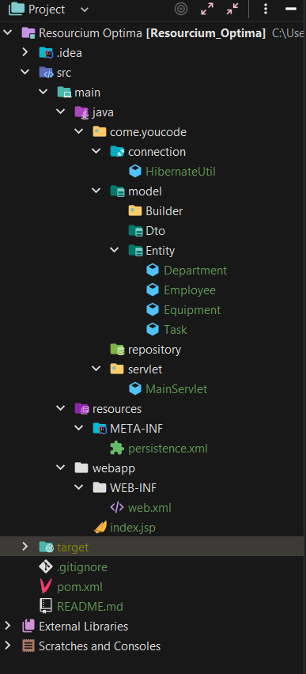
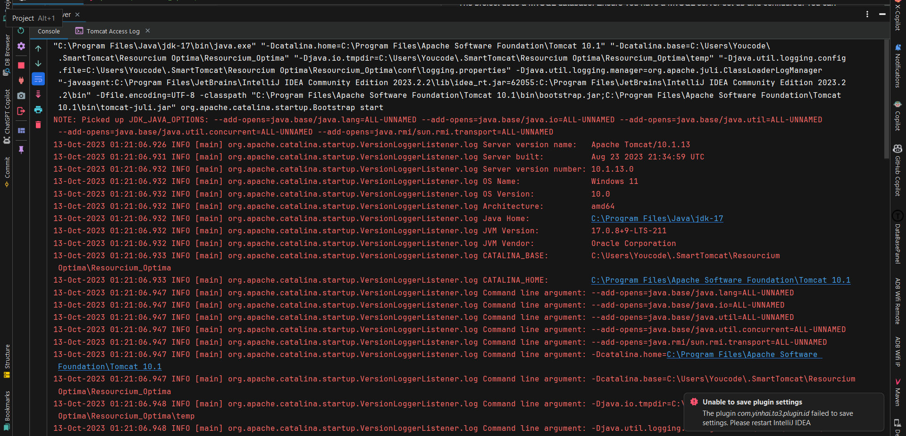
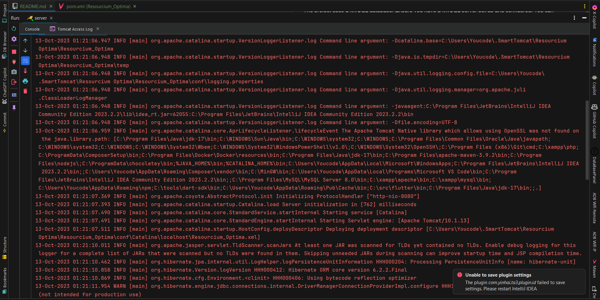
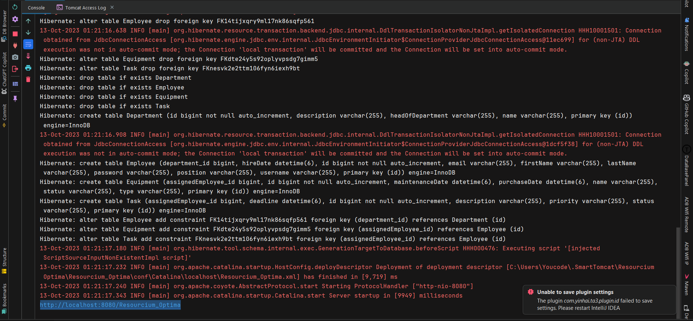
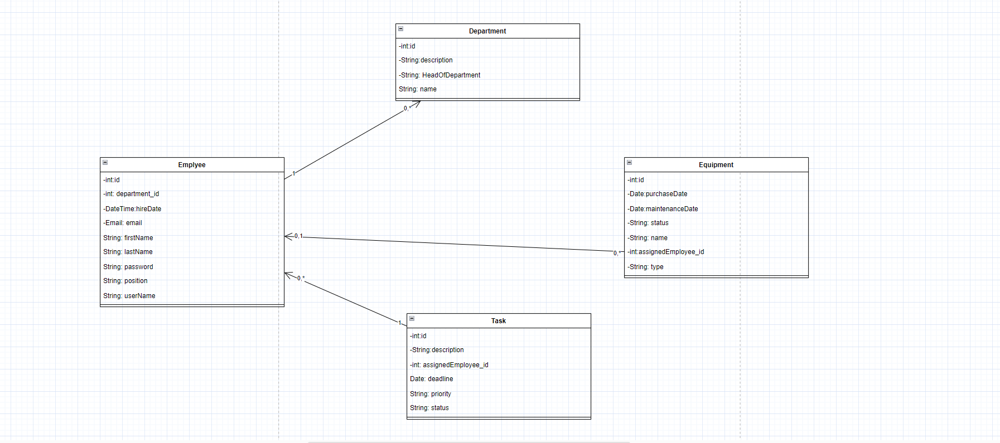
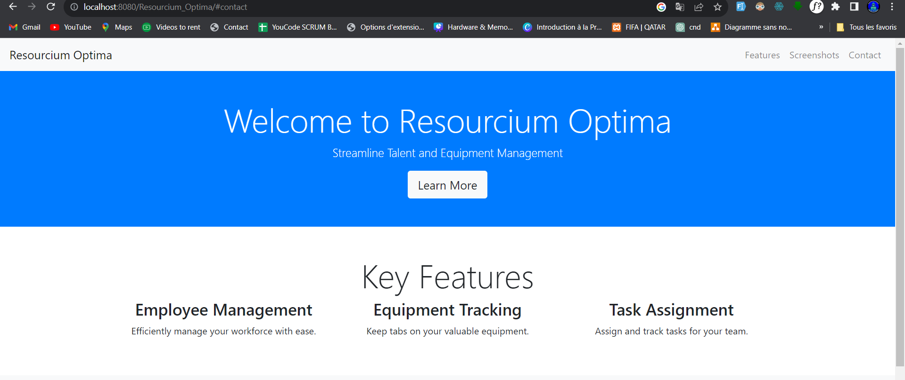

# Resourcium Optima Project Documentation

## Overview

Resourcium Optima is an enterprise talent and equipment management tool. This documentation provides developers with essential information about the project's technologies and setup.

## Table of Contents

1. [Technologies Used](#technologies-used)
2. [Project Structure](#project-structure)
3. [Database Configuration](#database-configuration)
4. [Setting Up the Development Environment](#setting-up-the-development-environment)
5. [How to Run the Project](#how-to-run-the-project)

## Technologies Used

The Resourcium Optima project utilizes a variety of technologies to support its functionality. The following table lists the key technologies:

| Technology       | Version |
|------------------|---------|
| Jakarta EE       | 8.0     |
| Hibernate        | 5.6     |
| JPA              | 2.2     |
| Servlets         | 5.0     |
| JSP              | 2.3     |
| MySQL Database   | 8.0     |
| Maven            | 3.8     |
| Java             | 17      |
| Git              | 2.x     |

## Project Structure

The project is structured as follows:



## Database Configuration

The project uses a MySQL database. Ensure you have a MySQL server set up and configured. You can customize the database configuration in the `persistence.xml` file.

```xml
<property name="hibernate.connection.driver_class" value="com.mysql.cj.jdbc.Driver"/>
<property name="hibernate.connection.url" value="jdbc:mysql://localhost:3306/your_database"/>
<property name="hibernate.connection.username" value="your_username"/>
<property name="hibernate.connection.password" value="your_password"/>
```
## Setting Up the Development Environment

1.  **Java Development Kit (JDK):** Ensure you have JDK 11 or higher installed.

2.  **Maven:** Install Maven 3.8 or higher.

3.  **Integrated Development Environment (IDE):** We recommend using IntelliJ IDEA or Eclipse for development.

4.  **Git:** Make sure you have Git installed to clone the project repository.


## How to Run the Project

1.  Clone the project repository using Git:

    bashCopy code

    `git clone https://github.com/yourusername/ResourciumOptima.git`

2.  Open the project in your chosen IDE.

3.  Configure the database connection in `persistence.xml`.

4.  Build the project using Maven:

    Copy code

    `mvn clean install`

5.  Deploy the project on your preferred Jakarta EE server.

6.  Access the application via your web browser: `http://localhost:8080/Resourcium_Optima`






## UML Diagram

The following UML diagram illustrates the relationships between the project's entities:



## Screenshots

### Home Page (index.jsp)

The following screenshot illustrates the home page of the Resourcium Optima application:



# JavaEE_JPA_Servlet

